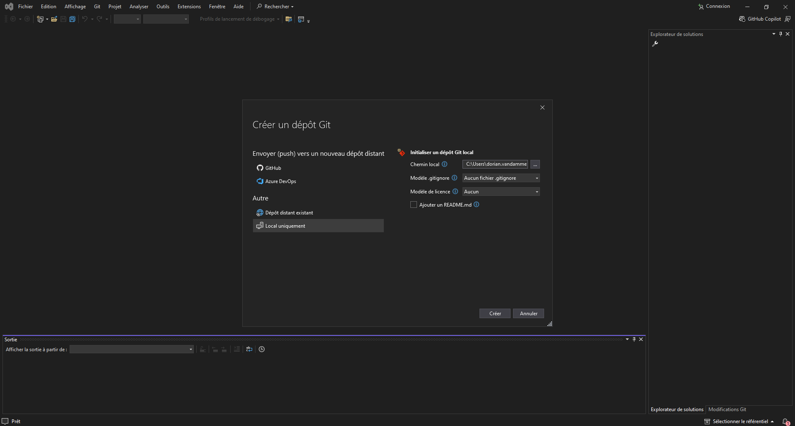
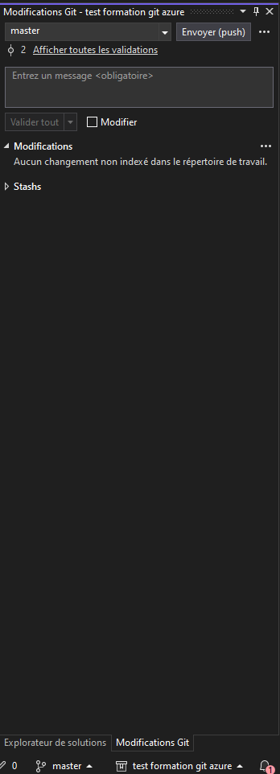
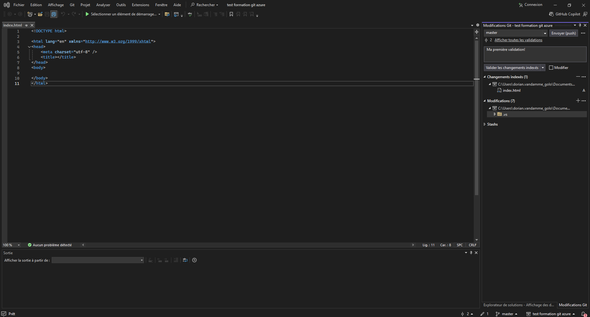

# Contexte
## But du laboratoire
### Quoi
Dans ce laboratoire, nous allons apprendre comment travailler localement sur son poste avec Git, comment créer un dépôt Git, réaliser son premier commit, réussir son dépôt et comprendre les caractéristiques des dossiers cachés .git.
### Pourquoi
Comprendre comment travailler localement avec Git est une étape essentielle pour tout développeur. Cela permet de suivre l'historique des modifications apportées à son code, de gérer les différentes versions de son code et de travailler en équipe en facilitant le partage de code et la collaboration.

# Instructions
## Dans Visual Studio
### Initaliser son dépot Git

Nous allons créer notre dépôt Git depuis notre éditeur Visual Studio. Commencez par créer un dossier vide et ouvrez le dans Visual Studio. Ensuite, allez dans le menu "Git" et cliquez sur "Créer un dépôt Git".
Choisissez l'option "local uniquement" dans la colonne de gauche, et dans la colonne de droite:
- dans le chemin local, choisissez le chemin vers le dossier que vous avez créé précédemment
- dans modèle .gitignore, choisissez aucun fichier .gitignore
- dans modèle de licence, laissez aucun
- et enfin ne cocher pas l'option pour ajouter un fichier readme.

Vous devriez avoir quelque chose qui ressemble à ça:



Appuiez sur "Créer".

En bas à droite de l'écran vous devriez voir un onglet "Modifications Git", cliquez dessus et vous devriez voir ceci qui apparait:



Si vous cliquez sur "Afficher toutes les validations" une fenêtre apparait avec l'ensemble des validations du dépôt. Il devrait y en avoir deux, faites automatiquement par Visual Studio lorsqu'on a créé le dépôt. Vous pouvez prendre un peu de temps pour regarder toutes les informations affichées et vous familliariser avec.

### Ajouter un fichier au dépôt

Nous allons ajouter un nouveau fichier au dépôt. Pour cela, aller dans le menu Fichier -> Nouveau -> Fichier (ou faites ctrl + n) et choisissez un fichier de type html. Vous devriez avoir un squelette de page html qui apparait. Sauvegardons le dans le dossier de notre dépôt, sous le nom d'index.html.

Si vous retournez voir l'onglet des modifications git, vous devriez voir des éléments dans la section "Modifications", dont notre fichier index.html. Nous allons ignorer les autres éléments. Cliquez sur le bouton "+" pour ajouter notre fichier à l'index et entrez un message de validation, comme "Ma première validation!".



Pour créer votre première validation, appuyer sur "Valider les changements indexés". Si tout va bien, vous devriez avoir une troisième validation ajouter à notre dépôt local.

## Avec des lignes de commande
### Initaliser son dépot Git et y ajouter un fichier
Comment faire un dépôt Git, réaliser son premier Commit :

Ouvrir le terminal ou l'invite de commande (Command Prompt sous Windows) et accéder au répertoire souhaité en utilisant la commande suivante :

```bash
cd chemin/vers/mon-répertoire
```

Initialiser un nouveau dépôt Git en utilisant la commande suivante :
```bash
git init
```

Créer un nouveau fichier nommé "index.html" dans le répertoire "mon-répertoire". Vous pouvez le faire en utilisant votre éditeur de texte préféré ou en utilisant la commande suivante dans votre terminal :
```bash
echo "Hello World" > index.html
```

Maintenant que le fichier a été ajouté dans le répertoire local, regardons au niveau de git avec la commande suivante:


```bash
git status
```

Vous obtiendrez comme réponse:
```bash
On branch main

No commits yet

Untracked files:
  (use "git add <file>..." to include in what will be committed)
        index.html
nothing added to commit but untracked files present (use "git add" to track)
```

Ajouter le fichier "index.html" à l'index des modifications en utilisant la commande suivante :
```bash
git add index.html
```

Exécutons à nouveau la commande de statut:
```bash
git status
```

Comparons maintenant la différence:
```bash
On branch master

No commits yet

Changes to be committed:
  (use "git rm --cached <file>..." to unstage)
        new file:   index.html
```


Réaliser votre premier commit en utilisant la commande suivante :

```bash
git commit -m "Ajout du fichier index.html"
```

Avec ces étapes, vous avez créé un nouveau dépôt Git, ajouté un nouveau fichier, indexé les modifications et réalisé votre premier Commit.


# Conclusion
### État du laboratoire 
A la fin de ce laboratoire vous devriez savoir:
- Créer un dépôt Git sur votre poste de travail
- Ajouter un fichier à l'index
- Realiser un commit