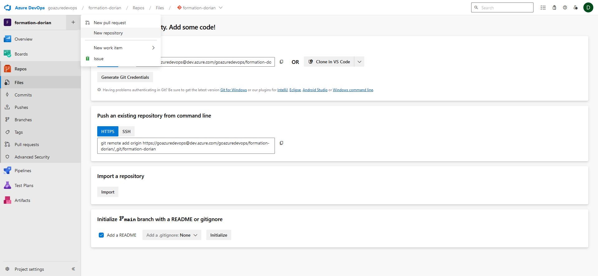

# Contexte
## But du laboratoire
### Quoi

Créer un dépot Git distant et le synchroniser avec le dépot local.

### Pourquoi

Assurer la persistance du dépôt Git et permettre de travailler en équipe.

# Instructions

## Créer son dépôt distant

Nous allons commencer par créer un dépôt dans notre instance Azure Devops. Pour cela assurer d'avoir un projet dans lequel vous avez le droit de créer un dépôt.

Allez dans l'onglet "Dépôt" ou "Repos" en anglais et cliquer sur le "+" à côté du nomn du projet Azure, vous devriez avoir l'option pour créer un nouveau dépôt. 



Donnez lui simplement un nom, de préférene le même que le nom du dossier contenant le dépôt git local créé pendant le lab 2, et décocher l'option d'ajouter un fichier "readme".


Cliquez sur le bouton "Créer".
Vous devriez maintenant être sur une page qui ressemble à ceci: 


## Lier son dépôt local au dépôt distant

### Avec Visual Studio

Pour ajouter un dépôt distant à notre dépôt local, il faut se rendre dans la section "Gérer les dépôts distants" du menu Git. Dans la fenêtre qui s'ouvre, cliquez sur le bouton "ajouter".

Entrez maintenant le nom et l'url du dépôt distant que nous avons créé précédemment. Vous devriez avoir un résultat qui ressemble à ça:


Cliquez sur "enregistrer".
Maintenant nous allons enoyer nos changements réalisés en local vers le dépôt distant. Pour cela dans le menu ou l'onglet git, vous pouvez appuyer sur le bouton "Envoyer (push)". Si vous n'avez aucun nom d'utilisateur enregistré, une nouvelle fenêtre devrait apparaitre, vous demandant de vous connecter à votre instance azure.

Si tout s'est bien passé, on devrait voir les validations que nous avons créé en local dans le dépôt distant, comme ceci:


Pensez à rafraichir votre navigateur au besoin!

### Avec des lignes de commandes

Maintenant que votre dépôt distant a été créé, il est temps de le lier au dépôt local.
- Depuis votre navigateur, copier l'URL du dépôt distant que vous venez de créer

- Sur votre ordinateur, ajoutez l'URL du dépôt Git distant en utilisant la commande suivante : 
  ```bash
  git remote add origin <url_du_depot>
  ```

- Envoyez vos modifications locales vers le dépôt distant en utilisant la commande suivante : 
  ```bash
  git push -u origin master.
  ```

## Synchroniser son dépôt local avec le dépôt distant

Pour voir comment récupérer des changements faits par une autre personne, nous allons simuler des changements sur le dépot distant en éditant notre index.html depuis notre navigateur :
- dans votre dépôt distant, cliquez sur index.html, puis cliquez sur le crayon à droite "éditer", cela ouvrira un éditeur
- Procédez à quelques changements dans la page, en ajoutant un titre dans la balise "title"
- Validez les modifications en cliquant sur le bouton "commit"
- Laissez le message de commit par défaut et appuyer une seconde fois sur le bouton "commit"

Pour ramener ces changements dans notre dépôt local, nous allons utiliser la commande suivante : 
```bash
git pull origin master.
```

Ou bien le bouton "Tirer" dans Visual Studio.

Si vous ouvrez index.html en local, vous verrez que les changements que vous avez fait sur le dépôt distant ont bien été ramenés dans votre dépôt local.

# Conclusion
### État du laboratoire 
A la fin de ce laboratoire vous devriez savoir:
- Créer un dépôt dans Azure
- Lier un dépôt local à un dépçot distant
- Pousser des changements sur un dépôt distant
- Récupérer des changements depuis un dépôt distant