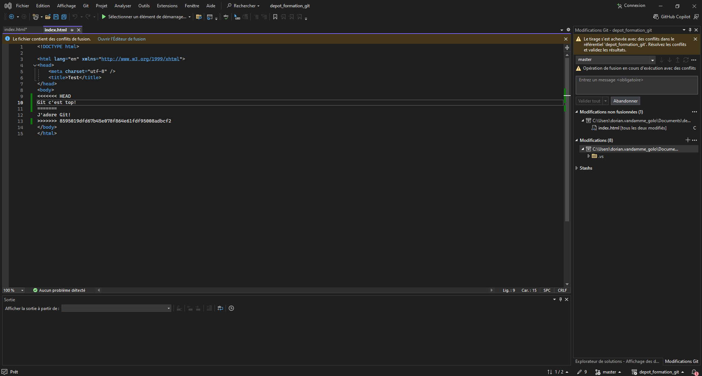
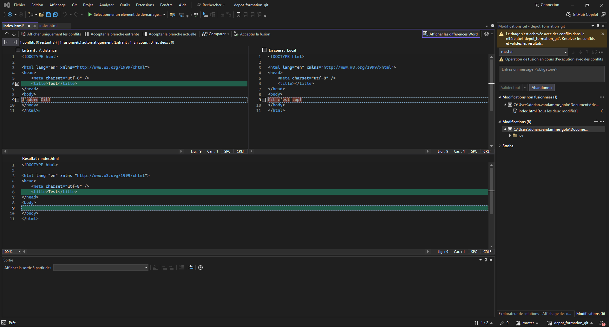

# Contexte
## But du laboratoire
### Quoi

Comprendre quand apparait un conflit et comment le résoudre.

### Pourquoi

Se préparer à la réalité du travail en équipe sur un dépot Git

# Instructions

## Générer un conflit

Pour générer un conflit nous allons faire comme dans le lab précédent et éditer index.html depuis notre navigateur.
- Ouvrez index.html et effectuez quelques changements, en ajoutant par exemple "J'adore git" sur une nouvelle ligne.
- Enregistrez et commitez les modifications en cliquant sur le bouton "commit"
- Laissez le message de commit par défaut et appuyer une seconde fois sur le bouton "commit"

Maintenant nous allons le modifier en local, sans le synchroniser avec le dépôt distant au préalable:
- Ouvrez index.html en local avec votre éditeur
- Procédez à quelques changements dans le texte, mais différents de ceux faire sur le dépôt distant, par exemple en ajoutant "Git c'est top!" sur une nouvelle ligne
- Enregistrez et validez les modifications sans les envoyer vers le dépot distant (pousser/push)

Ainsi nous avons créé une source de conflit, car nous avons fait divergé les historiques de nos deux dépôts sur un même fichier.

## Résoudre un conflit

Pour provoquer le conflit nous allons pull les changements depuis le dépôt distant. Un message de ce genre devrait apparaitre :
```bash
[master 9d1e627] conflit
 1 file changed, 0 insertions(+), 0 deletions(-)
PS C:\Users\dorian.vandamme_golo\Documents\test> git pull
remote: Enumerating objects: 5, done.
remote: Counting objects: 100% (5/5), done.
remote: Total 3 (delta 0), reused 0 (delta 0), pack-reused 0
Unpacking objects: 100% (3/3), 655 bytes | 54.00 KiB/s, done.
From https://github.com/Dorian-Vandamme/mon-premier-repo
   74ca349..7d0f133  master     -> origin/master
warning: Cannot merge binary files: index.html (HEAD vs. 7d0f1337da429025642039375950106c24e9ca05)
Auto-merging index.html
CONFLICT (content): Merge conflict in index.html
Automatic merge failed; fix conflicts and then commit the result.
```

Si on ouvre le fichier, il devrait alors avoir cet allure:
```
<<<<<<< HEAD
Hello World!! 
J'adore Git!
=======
Hello World!!
Git c'est super!
>>>>>>> 3ee2a6d8957f0b3488af8981fa4a614f06ab1aa6
```

## Résoudre un conflit manuellement

Les lignes en conflits sont comprises entre des délimiteurs. La première partie contient les changements présents dans notre version en local, tandis que la seconde partie contient les changements présents dans notre version en remote.
Il faut éditer les lignes en conflit en choisissant soit la version en local, soit la version en remote, soit adapter manuellement en prenant des lignes de l'une et de l'autre.
Il ne faut pas oublier de retirer les délimiteurs une fois le conflit résolu.

On peut ensuite sauvegarder le fichier, l'ajouter à l'index, faire un nouveau commit et le pousser sur le dépot distant.

## Résoudre un conflit avec Visual Studio

Dans Visual Studio, l'outil devrait vous proposer d'ouvrir l'Éditeur de fusion:



Ouvrez le et vous pourrez facilement résoudre les conflits. Il suffit de cocher la ou les lignes que vous voulez concervez, le résultat final apparait dans la fenêtre en bas de l'écran.



N'oubliez pas de faire une nouvelle validation après avoir résolu le conflit en cliquant sur "Accepter la fusion"!

# Conclusion
### État du laboratoire 
A la fin de ce laboratoire vous devriez savoir:
- D'où peut venir un conflit
- Comment résoudre un conflit