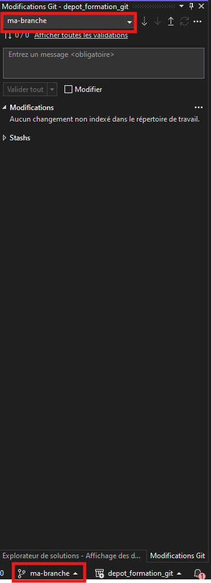
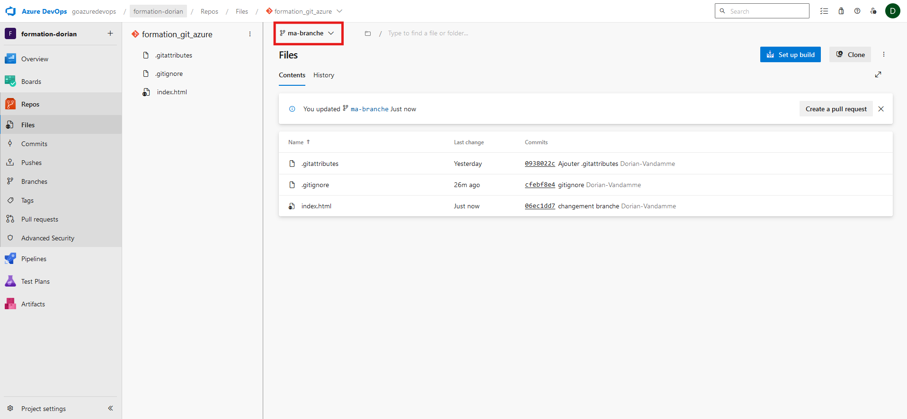
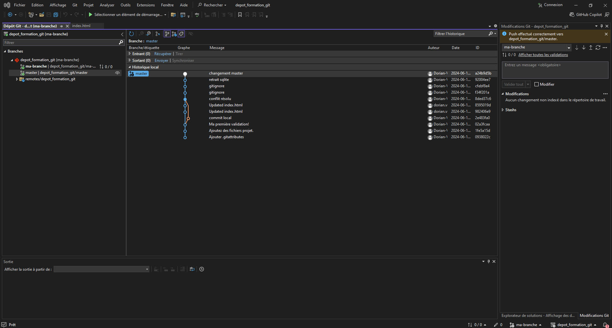

# Contexte
## But du laboratoire
### Quoi

Créer une branche, fusionner deux branches et créer une pull request.

### Pourquoi

S'initier à l'utilisation des branches, qui sont une des fonctionnalités les plus importantes de Git.

# Instructions

## Créer une branche

### Dans Visual Studio

Pour créer une branche dans Visual Studio, dans le menu "Git" il y a une option pour créer une nouvelle branche. CLiquez dessus et donnez lui un nom, par exemple ma-branche. Cliquez sur "Créer".

Si tout s'est bien passé, vous devriez voir que la branche active est désormais "ma-branche":



Nous allons ajouter une nouvelle modification au fichier, par exemple une ligne dans la balise "<body>", qui dirait "Changement fait sur ma branche".

Une fois que c'est fait, faites une nouvelle validation, et poussez la sur le dépôt distant.

### En ligne de commande

Pour créer une branche nous allons utiliser la commande git suivante:
```bash
git checkout -b ma-branche
```

Où ma-branche est le nom de la branche que nous voulons créer. Cette commande permet de créer une branche et de se placer dessus directement.
Nous allons maintenant faire un changement dans cette branche:
- Ajouter une ligne "Changement fait sur ma-branche" dans index.html
- Commiter les modifications en utilisant la commande suivante :
```bash
git commit -m "Changement fait sur ma-branche"
```
- créer la branche sur le dépôt distant et pousser les changements en utilisant la commande suivante :
```bash
git push --set-upstream origin ma-branche
```

### Voir sa branche dans le dépôt distant

Si l'on se rend sur le dépôt distant depuis notre navigateur, on peut voir la branche créée en cliquant sur le bouton déroulant "master" puis en cliquant sur le nom de la branche que nous avons créée.



## Fusionner deux branches

Plaçons nous dans le contexte suivant:
- Des nouveaux changements ont été apportés à master pendant que vous travailliez sur votre branche ma-branche
- Vous voulez donc ramenez les changements de master vers votre branche de travail, pour rester à jour

### Dans Visual Studio

Pour commencer nous allons repasser sur la branche master. Pour ça, cliquez sur le menu déroulant qui dit qu'on est actuellement sur "ma-branche" et dans la liste choisissez "master".

Réalisez un nouveau commit dans master en ajoutant une nouvelle ligne dans le fichier "index.html". Pousser le sur le dépôt distant.

Repasser sur la branche "ma-branche" et nous allons fusionner la branche master dans "ma-branche". Pour cela, ouvrez le menu Git et choisissez l'option "Gérer les branches", vous devriez avoir une fenêtre qui ressemble à ça:



Faites clic droit sur la branche master et choisissez "Fusionnez master dans ma-branche". Il y aura probablement un conflit à résoudre, résolvez le comme expliqué dans le lab 4.

Une fois que c'est fait, validez le tout et pousser le sur le dépôt distant.

### En ligne de commande

On va donc commencer par faire un changement sur master. Pour repasser sur master, nous allons utiliser la commande suivante :
```bash
git checkout master
```

Comme dans les précédents labs, nous allons éditer index.html en y ajoutant une ligne, puis nous pousserons les modifications vers le dépôt distant.

Une fois que c'est fait, nous allons repasser sur la branche ma-branche:

```bash
git checkout ma-branche
```

Nous allons maintenant ramener les changements de master vers ma-branche :
```bash
git merge master
```

Il y aura probablement un conflit, selon les modifications que vous avez apportés. Comme montré dans le lab précédent, résolvez le conflit de la façon que vous voulez.
N'oubliez pas de pousser le commit de fusion vers le dépôt distant.

## Creer une pull request

Maintenant nous voulons ramener les changements de notre branche de travail vers master, pour le partager avec le reste de l'équipe.
On pourrait fusionner localement nos branches ma-branche et master, mais ce n'est pas une bonne pratique.
À la place, il faut créer ce qu'on appelle une pull request:
- Rendez vous depuis votre navigateur dans votre dépôt sur azure
- Vous aurez sûrement un encart qui vous propose directement de créer une pull request
 
- vous pouvez cliquer sur le bouton "Create a Pull Request"

Si vous n'avez pas ce bouton:
- Allez dans la section "Pull Request"
- Puis cliquez sur le bouton "New Pull Request"
- Dans Select a source branch, choisissez ma-branche

 

Il faut saisir quelques informations pour créer une pull request
- le titre doit décrire brièvement les changements que vous voulez apporter
- Si besoin, ajouter une description plus détaillée que le titre
- le reviewer sera la personne chargée de faire la revue de code de votre Pull Request

Quand notre Pull Request est approuvée, on peut cliquer sur le bouton "Complete". La fusion sera alors réalisée dans le depot distant.
Lors du prochain pull de master sur notre dépôt local, on verra les changements de notre Pull Request dans master, en local.


# Conclusion
### État du laboratoire
A la fin de ce laboratoire vous devriez savoir:
- Créer votre propre branche
- fusionner une branche dans une autre
- creer une pull request

### Allez plus loin 

```bash 
git log --graph --format=format:'%C(bold blue)%h%C(reset) - %C(bold green)(%ar)%C(reset) %C(white)%an%C(reset)%C(bold yellow)%d%C(reset) %C(dim white)- %s%C(reset)' --all
```